# 00 - Setup e Configuração de ambiente

Você irá utilizar 2 ferramentas para desenvolver os laboratorios:

1. Conta AWS através da AWS Academy. Conta provisionada para você utilizar durante essa disciplina com 50 dólares de crédito.
2. Cloud 9 IDE. Uma IDE cloud dentro da AWS para todos terem um ambeinte igual e com a autorização para executar os comandos dos exercicios.

### Conta AWS - Academy

1. Caso não tenha conta no AWS Academy ainda:
   1. Entre no seu email da FIAP pelo endereço [webmail.fiap.com.br](http://webmail.fiap.com.br/)
   2. Seu email é no seguinte formato rm + numero do seu RM + @fiap.com.br. Caso seu RM seja por exemplo 12345 seu email seria <rm12345@fiap.com.br>. A senha é a mesma de portais.
   3. Você terá um email na caixa de entrada para convite do Academy, siga as instruções.
   4. Ao conseguir entrar na plataforma do academy, aparecerá uma turma que começa com `AWS Academy Learner Lab`. Apenas clique em `Enroll` para aceitar e acessar.
2. Para entrar na conta do Academy que já existe, acesse o link:  [awsacademy.com/LMS_Login](https://www.awsacademy.com/LMS_Login). Ao conseguir entrar na plataforma do academy, aparecerá uma turma que começa com AWS Academy Learner Lab. Apenas clique em Enroll para aceitar e acessar.
3. Dentro da plataforma clique em `cursos` na lateral esquerda e clique no curso da disciplina atual. O professor irá informar qual o núemro do curso que você deve acessar.

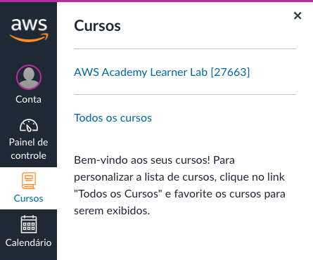

3. Dentro do curso clique em `Módulos` na lateral esquerda

   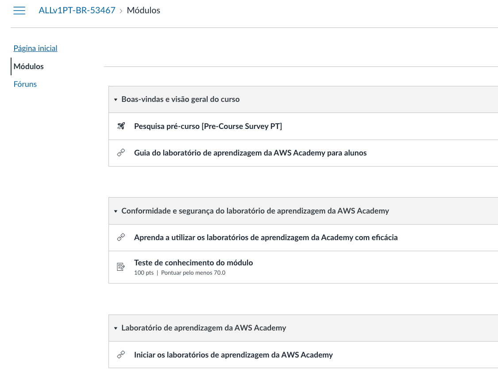

4. Clique em `Iniciar os laboratórios de aprendizagem da AWS Academy`

   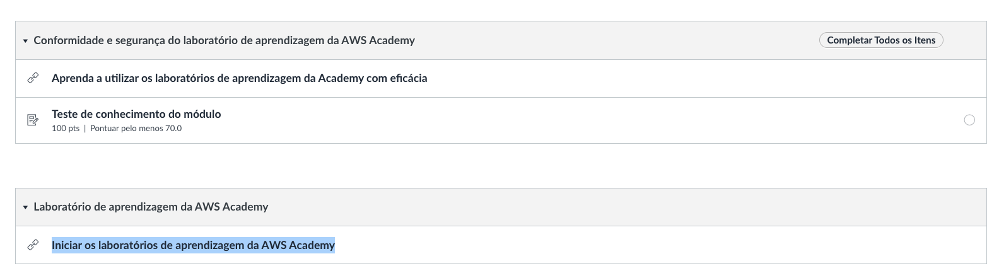

5. Se for seu primeiro acesso irão aparecer os 2 contratos de termos e condições para aceitar. Role até o final para aceitar após a leitura do mesmo. Caso já tenha feito isso antes. Pule para o passo 8.
   
   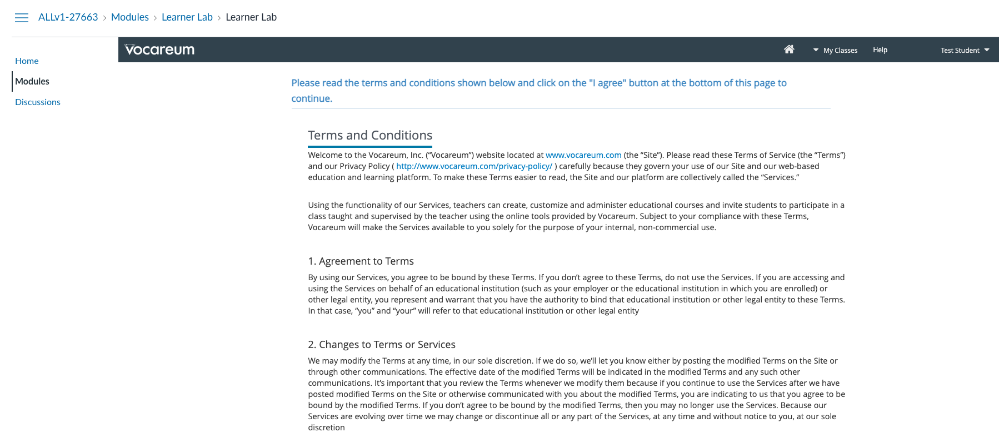

6. Clique no link iniciando com `Academy-CUR` para acessar a conta AWS.Caso peça consentimento clique em `I agree` e execute o passo novamente.
   
   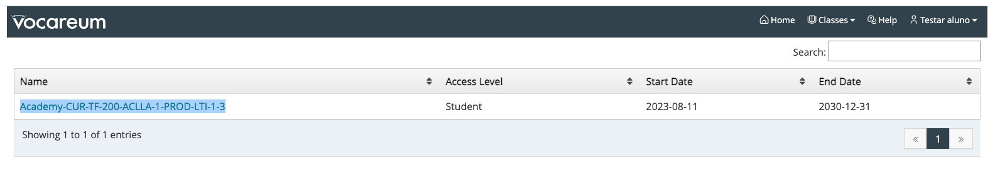

7. Essa é a tela para acessar sua conta AWS. Cada sessão terá 4 horas. Após esse tempo você terá que começar outra sessão, mas os dados gravados dentro da conta AWS ficam salvos até o final do curso ou entrega do trabalho final da disciplina. Clique em `Start Lab` para iniciar uma sessão. Esse processo pode demorar alguns minutos.

   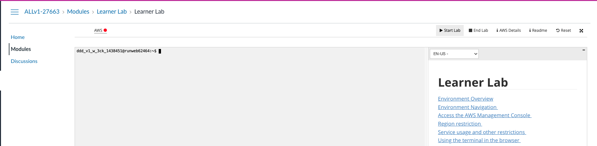

   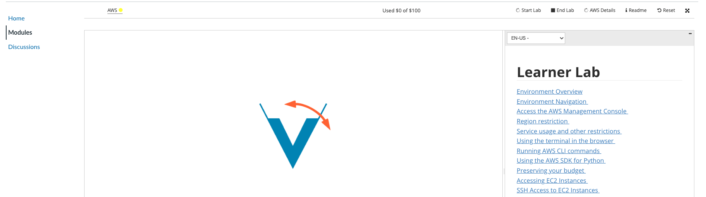

8. Quando tudo estiver pronto a bolinha ao lado do escrito `AWS` no superior esquerdo da tela ficará verde como na imagem abaixo. Apenas clique em `AWS` para abrir a conta aws em outra aba do navegador.

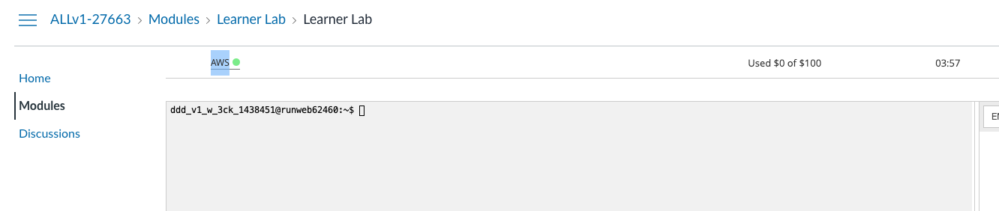

### Cloud 9

1. Abra o console da AWS e va para o serviço `Cloud 9` através da barra de pesquisas.

   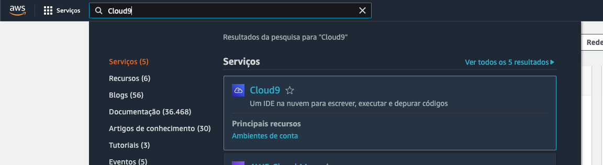

2. garanta que a região que esta utilizando é `us-east-1/ Norte da Virgínia`. Você consegue ver isso no canto superior direiro da tela.

    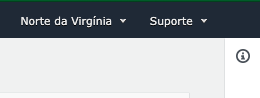

3. Clique em `create environment`.
4. Coloque o nome `lab-fiap` .

   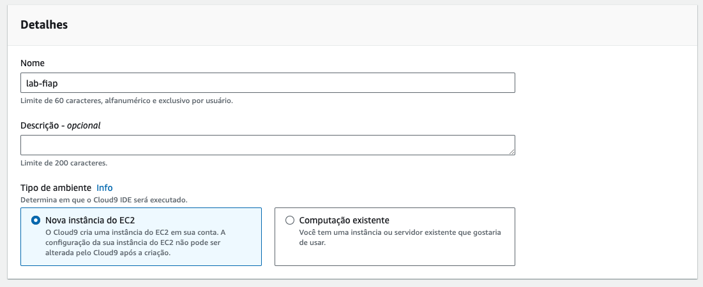

5. Deixe as configurações como na imagem a seguir. Se atente ao tipo da maquina que deve ser `t2.medium` e o sistema operacional `Ubuntu Server 22.04 LTS`:

   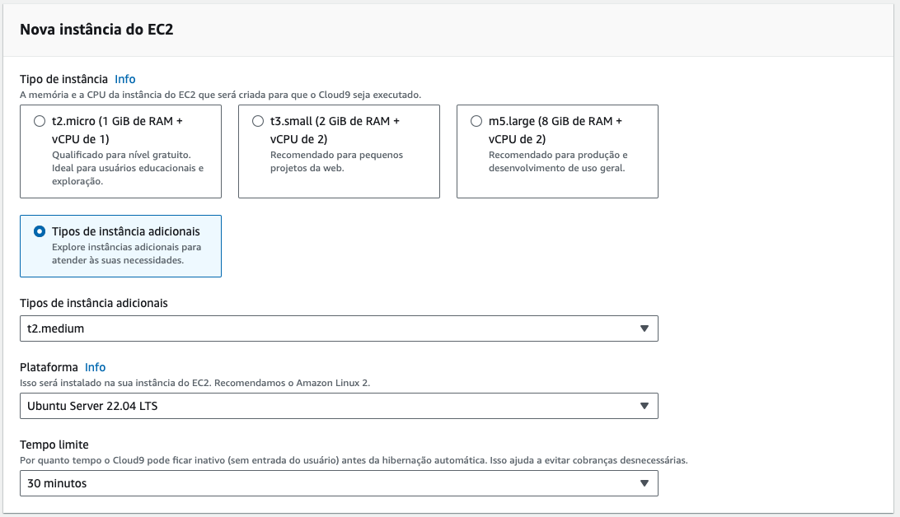

6. Em `Configurações de rede` selecione 'Secure Shell (SSH)' deixe como na imagem a seguir:
  
  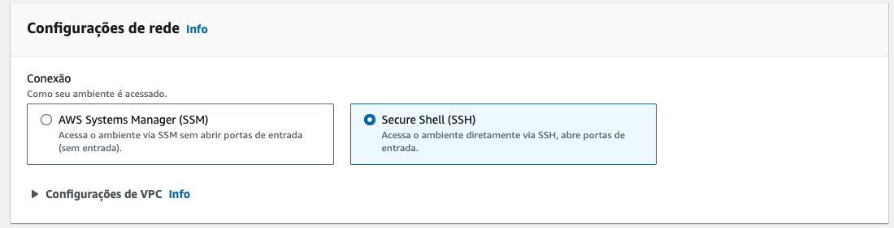

7. Caso todos os passos anteriores estejam corretos, clique em `Criar`.
8. A criação do ambiente pode levar alguns minutos.

    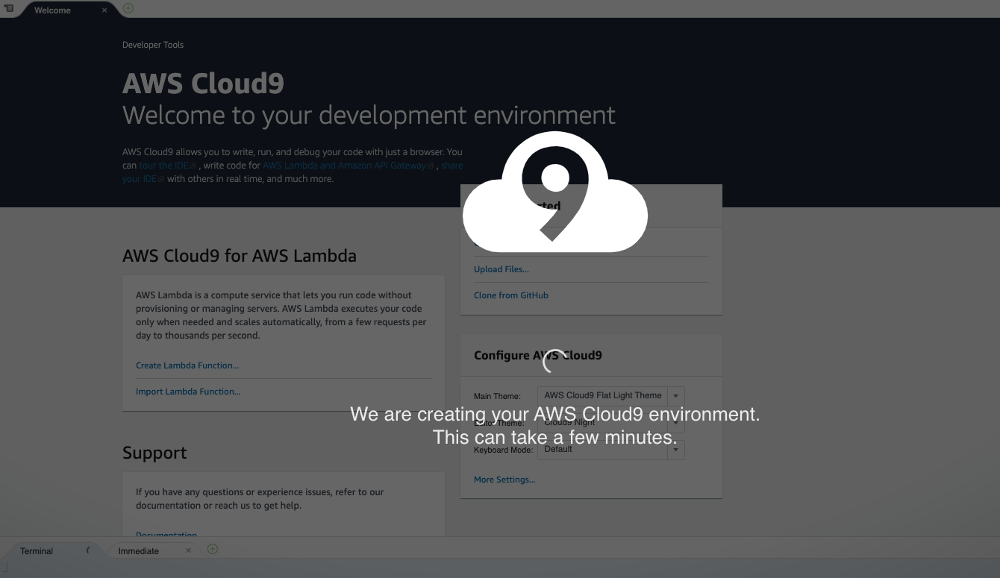

9. Após a criação clique em `Em aberto`, caso o IDE não tenha aberto automaticamente.
   
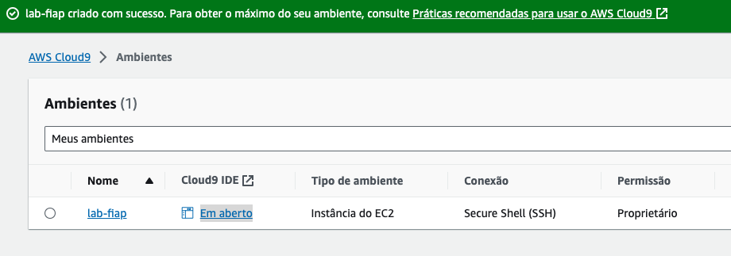

10. Para os próximos comandos utilize o console bash que fica no canto inferior do seu IDE Cloud9.
   
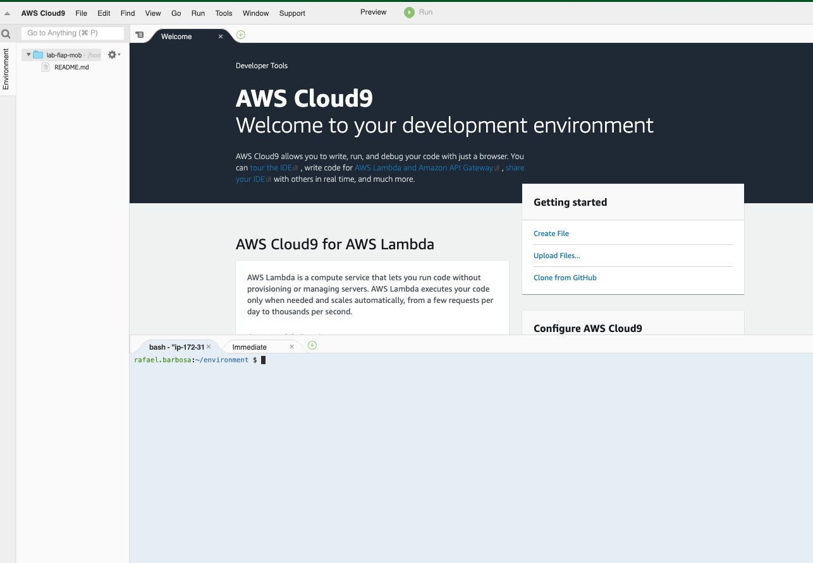

1.   Execute o comando `npm install -g serverless` para instalar o serverless framework.
    
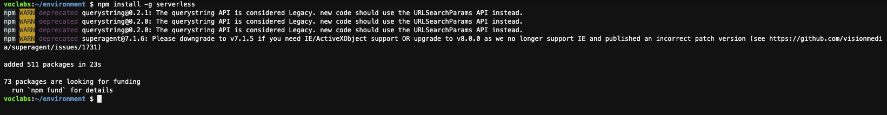

12.  Execute o comando `sudo apt update -y && sudo apt  install jq -y` para instalar o software que irá nos ajudar a ler e manipular Jsons no terminal. Caso esse comando de erro, aguarde 3 minutos para o sistema terminar a preparação inicial.
13. Execute o comando `sudo npm install -g c9` para baixar a extenção que ajudará o Cloud9 a lidar melhor com o como abrir arquivos no IDE.
14. Execute o comando `git clone https://github.com/vamperst/FIAP-CICD-DevSecOps.git` para clonar o repositório com os exercicios.
15. Execute o comando `cd FIAP-CICD-DevSecOps/` para entrar na pasta criada pelo git
16. Execute o comando `cd 00-Setup-e-configuracao` para entrar na pasta com os scripts de Configuração.
17. Precisamos aumentar o tamanho do volume(HD) do cloud9. Para isso execute o comando  `sh resize.sh`
   
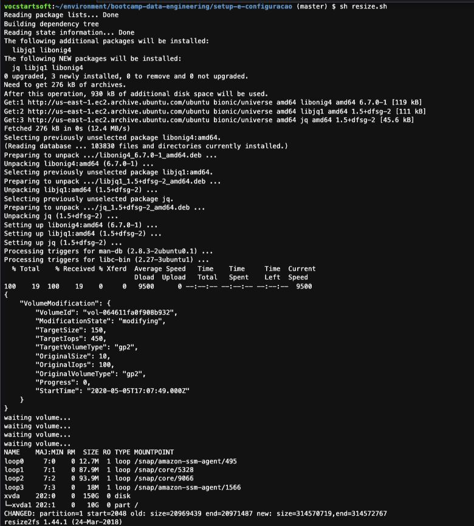

> [!TIP]
> Caso o comando fique parado por mais de um minuto, aperte `Q` com o terminal selecionado para sair do comando e continuar a execução do tutorial normalmente.

18.  Agora vamos criar o Bucket S3 que irá receber todos os arquivos de configuração durante o curso. Para tal, abra uma [aba do console AWS](https://us-east-1.console.aws.amazon.com/console/home?region=us-east-1). Clique em serviços no canto superior esquerdo e pesquisa e clique em S3.

19. Clique em 'Criar bucket'
    

20.  De o nome do bucket de `base-config-SEU RM` e clique em `Criar` no final da página. Não há necessidade de alterar nenhum outro parametro.

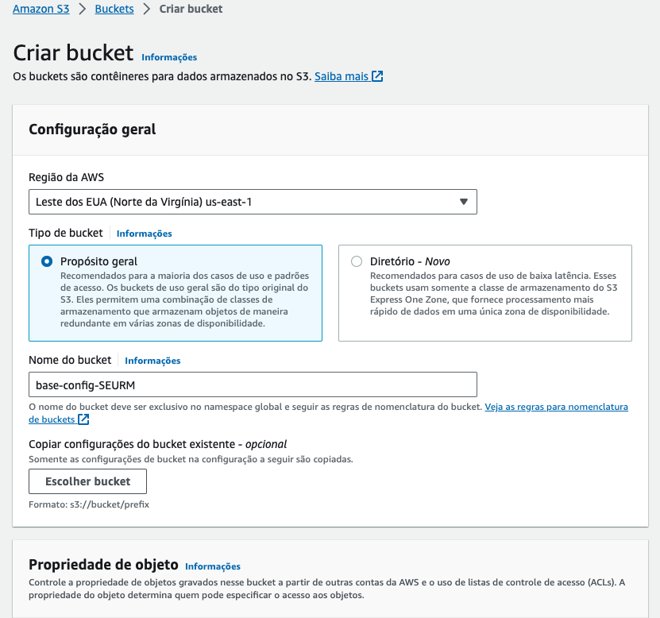

21. Devolta ao terminal do Cloud9 execute o comando `c9 open ~/.ssh/vockey.pem` para criar o arquivo que utilizaremos como chave para entrar nas instâncias EC2. Você vai notar que o comando abriu um arquivo vazio no IDE. Deixe ele aberto por enquanto.

22. Utilizando a mesma aba do AWS Academy onde acessa a conta da AWS e no canto superior direito clique em 'AWS Details' e clique em 'show' nos campos de SSH Key.

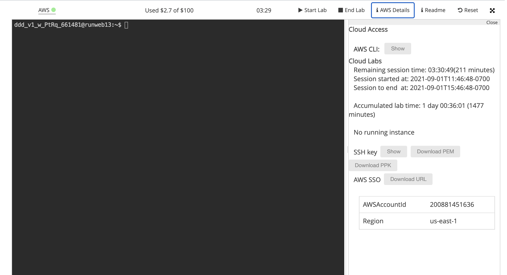

22. Copie o conteudo da chave privada para a area de transferência(Ctrl+C).
    
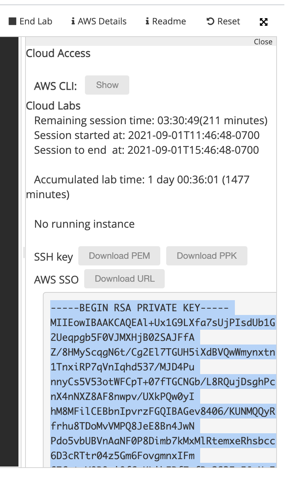

23. Cole o conteudo da chave privada copiado nos passos anteriores e cole no ide no aquivo vockey.pem aberto no cloud9 nos passos anteriores e salve utilizando "ctrl+S".
24. Execute no terminal do cloud9 comando `chmod 400 ~/.ssh/vockey.pem` para que a chave tenha a permissão correta.
25. Execute o comando a seguir para instalar o terraform `sh installTerraform.sh`
