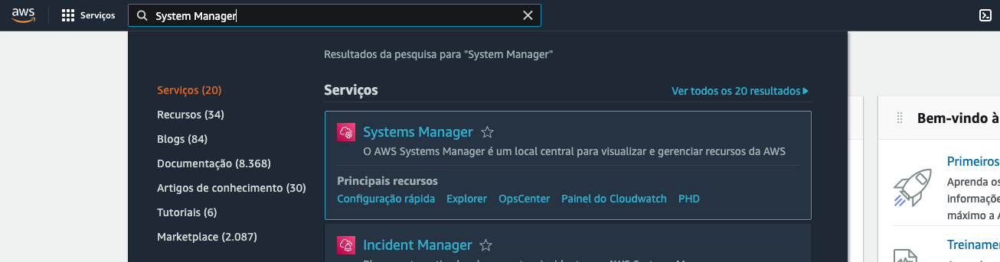
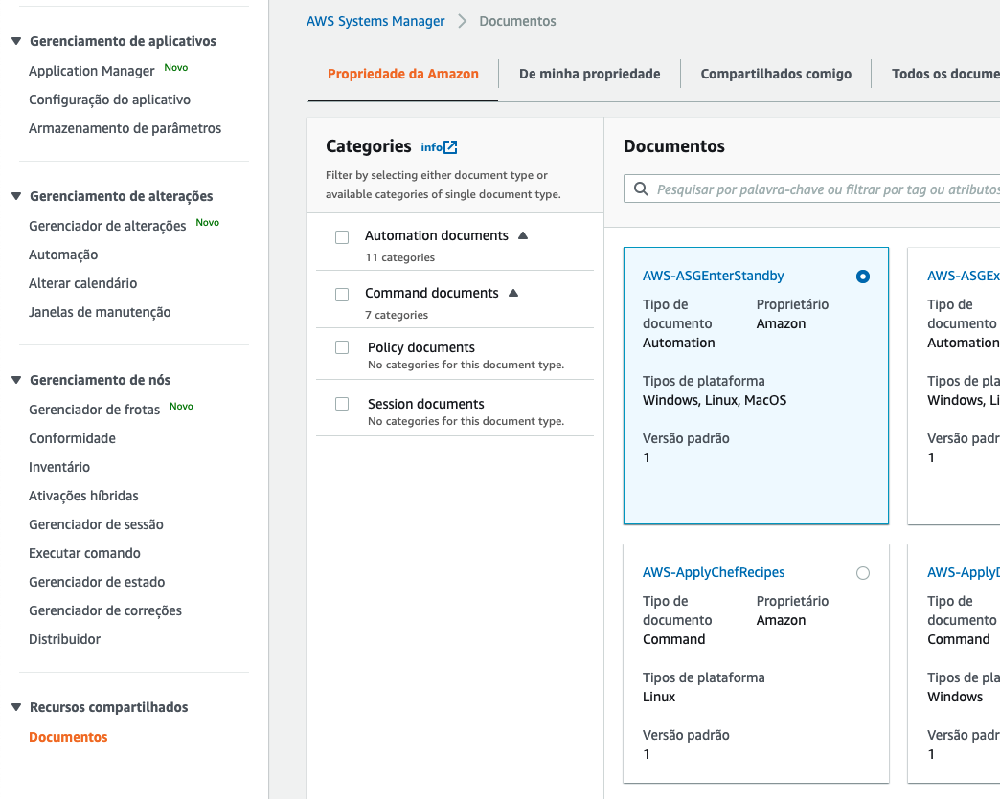
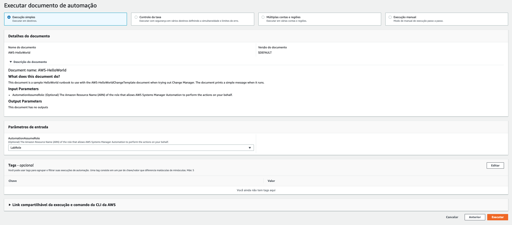
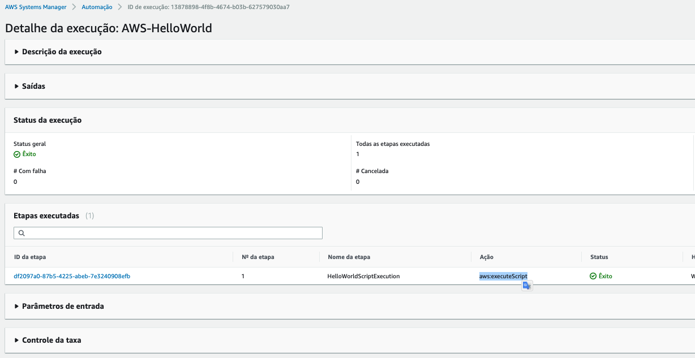
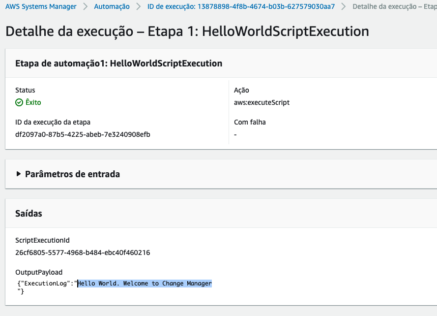

# 01 - System Manager - Hello World

1. Acesse o serviço `System manager` utilizando a barra de pesquisa de serviços no console AWS. Pesquise e selecione como na imagem abaixo.
 
2. No menu lateral esquerdo clique em `Documentos`. Esta na seção `Recursos Compartilhados`.
 
3. Na pesquisa de documentos pesquise por `helloworld` para achar o documento `AWS-HelloWorld`. Clique em `AWS-HelloWorld`.
   
4. Explore as abas do docuemnto e veja o conteúdo em yml assim como descrição e detalhes.
5. Clique em `Executar automação` no canto direto superior da tela.
6. Escolha as seguintes opções como na imagem:
   
7. Clique em executar.
8. Se tudo der certo a tela ficará como na imagem:
   
9. Clique no `ID da etapa` para ver os detalhes/logs da execução.
10. Verá que o log consta uma mensagem de hello world como esperado.
    
