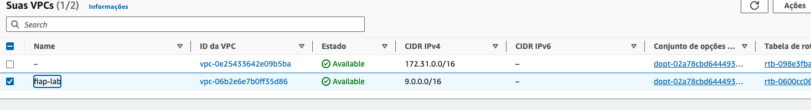
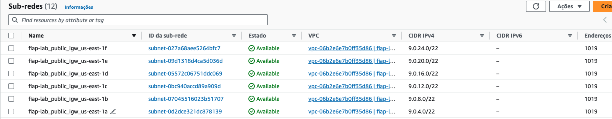

1. Execute o comando `cd ~/environment/FIAP-CICD-DevSecOps/02-Terraform/demos/02-Modules/` para entrar na pasta do exercício.
2. Entre na pasta vpc-call com o comando `cd vpc-call`
3. Execute o comando `terraform init`
4. Execute o comando `terraform plan`
5. Execute o comando `terraform apply -auto-approve`
6. Após o termino vá ao painel da aws e confira se a VPC, subnets e Rotas foram [criadas](https://us-east-1.console.aws.amazon.com/vpc/home?region=us-east-1#subnets:)
   
   
--------------------------------------------------------------------------------------
   

7. Agora vamos subir as Route Tables. Para tal volte uma pasta com o comando `cd ~/environment/FIAP-CICD-DevSecOps/02-Terraform/demos/02-Modules/` e entre em rt-call com o comando `cd RT-call/`
8. Execute o comando `terraform init`
9.  Execute o comando `terraform plan`
10. Execute o comando `terraform apply -auto-approve`
11. Analise o código, olhe os resultados no painel do serviço VPC e faça questionamentos. Foi criada uma VPC com uma subnet publica para cada zona de disponibilidade e as rotas para um internet gateway também criado via código.
