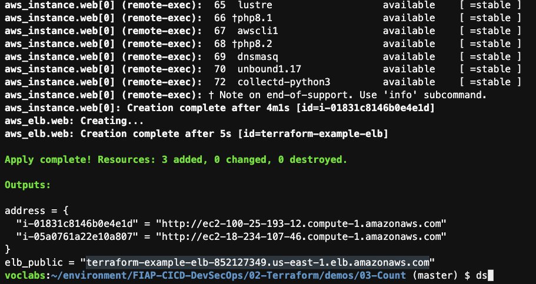
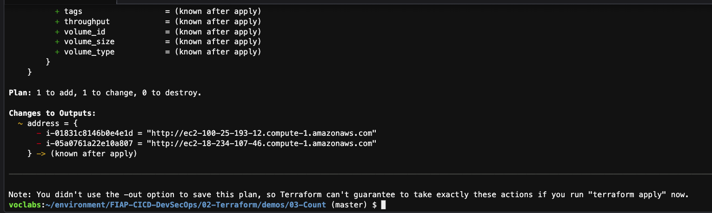
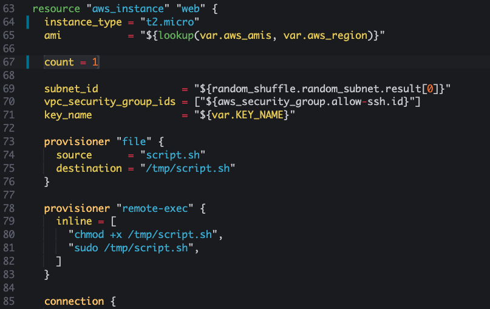

1. Execute o comando `cd ~/environment/FIAP-CICD-DevSecOps/02-Terraform/demos/03-Count/` para entrar no diretório do exercício.
2. Execute o comando `terraform init`
3. Execute o comando `terraform apply -auto-approve`
4. Aguarde alguns minutos para que todas as maquinas estejam prontas no ELB e o script terraform termine com sucesso. Após o termino no [painel](https://us-east-1.console.aws.amazon.com/ec2/home?region=us-east-1#LoadBalancer:loadBalancerArn=terraform-example-elb;tab=targetInstances) note que o ELB estará com todas as maquinas em estado `Fora de serviço`.
   
5. Aguarde até que todas estejam em `Em serviço`.
   
6. Utilize o dns do ELB fornecido como saida no terraform no cloud9 para colar no navegador e testar o funcionamento da Stack
   
   
7. Abra o arquivo main.tf com o comando `c9 open main.tf` e altere o valor do count para 3 na linha 67.
   
8. Execute o comando `terraform plan` para verificar o que será alterado. Note que tem 1 item para adicionar e 1 para alterar. O item para adicionar é a nova maquina e o item para alterar é o ELB que terá que adicionar a nova maquina.
   
9. Execute novamente o comando `terraform apply -auto-approve`
   
10. Note no [painel da AWS](https://us-east-1.console.aws.amazon.com/ec2/home?region=us-east-1#LoadBalancer:loadBalancerArn=terraform-example-elb;tab=targetInstances) que a maquina foi criada e já colocado no ELB
   
11. Vá novamente até o arquivo `main.tf` e altere o valor do count para 1
      
12. Execute novamente o comando `terraform apply -auto-approve`
    
13. Dessa vez no [painel da AWS](https://us-east-1.console.aws.amazon.com/ec2/home?region=us-east-1#LoadBalancer:loadBalancerArn=terraform-example-elb;tab=targetInstances) foram 2 destruições de maquina e uma alteração no ELB
    
14. Execute o comando `terraform destroy -auto-approve`

### Exercicio
Caso deseje fazer um exercicio prático para ajudar a fixar o conteudo faça o proposto na seguinte página: [Exercício](../../exercicios/count/README.md)
