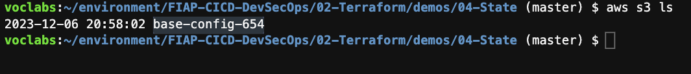
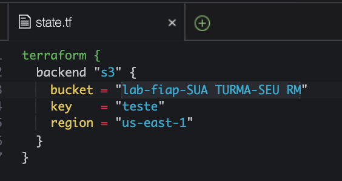

1. Execute o comando `cd ~/environment/FIAP-CICD-DevSecOps/02-Terraform/demos/04-State/` para entrar na pasta do exercicío.'
2. Vamos utilizar o bucket criado na configuração inicial para guardar o estado remoto. Caso não se lembre o nome utilize o comando `aws s3 ls` para poder copiar o nome.

    

3. Entre na pasta 'test' com o comando `cd test`
4.  Utilize o comando `c9 open state.tf` para abrir o arquivo responsavel por configurar o estado remoto e adicione o nome do seu bucket S3 na linha 3.
   
   

<details>
<summary> 
<b>Explicação Código Terraform</b>

</summary>

<blockquote>

O arquivo Terraform descreve a configuração do backend para armazenar o estado do Terraform em um bucket do Amazon S3. Vou explicar linha por linha:

```hcl
terraform {
  backend "s3" {
    bucket = "lab-fiap-SUA TURMA-SEU RM"
    key    = "teste"
    region = "us-east-1"
  }
}
```

### Explicação:

1. **`terraform {`**  
   Inicia o bloco de configuração principal do Terraform. Esse bloco é usado para definir configurações globais para o Terraform.

2. **`backend "s3" {`**  
   Configura o backend do Terraform para usar o S3 como o local de armazenamento do arquivo de estado. O backend armazena informações sobre os recursos provisionados e é essencial para a execução do Terraform, especialmente em equipes.

3. **`bucket = "lab-fiap-SUA TURMA-SEU RM"`**  
   Define o nome do bucket S3 onde o arquivo de estado será armazenado. Você precisará substituir "SUA TURMA-SEU RM" pelo nome real do bucket.

4. **`key = "teste"`**  
   Define o caminho do arquivo dentro do bucket S3. O arquivo de estado será salvo com o nome especificado (neste caso, "teste"). Esse caminho pode ser estruturado para melhor organização.

5. **`region = "us-east-1"`**  
   Especifica a região da AWS onde o bucket S3 está localizado. Neste caso, é "us-east-1" (Costa Leste dos EUA).

6. **`}`**  
   Fecha o bloco do backend.

7. **`}`**  
   Fecha o bloco principal do Terraform.

### Resumo:
Este script configura o Terraform para usar o S3 como backend, garantindo que o estado seja armazenado de forma remota e compartilhada. Isso é particularmente útil para colaboração entre equipes e para segurança do estado do Terraform.

</blockquote>
</details>

5. Utilize o comando `terraform init` para sincronizar com o estado remoto
6. Execute o comando `terraform apply -auto-approve`
7. Se for agora no [bucket do S3](https://s3.console.aws.amazon.com/s3/buckets?region=us-east-1) que criou para o exercicio você poderá ver que foi criado um arquivo com o nome teste. Nele constam todas as indormações de tudo que o terraform executou dentro da pasta test. Verifique baixando o arquivo e lendo.

<details>
<summary> 
<b>Explicação arquivos criados no S3</b>

</summary>

<blockquote>

Com a configuração fornecida, ao executar o Terraform, o seguinte será criado no bucket S3 especificado para armazenar o estado do Terraform:

---

### **Arquivos e Estrutura Criados no S3**

#### 1. **Arquivo principal do estado (`teste`)**
   - **Localização**: Dentro do bucket S3 especificado (`lab-fiap-SUA TURMA-SEU RM`), será criado um arquivo chamado `teste`.
   - **Conteúdo**:
     - Esse arquivo armazena o **estado do Terraform** (informações detalhadas sobre os recursos provisionados na infraestrutura, como IDs, configurações e dependências).
     - Ele é usado pelo Terraform para rastrear o que já foi criado, atualizado ou deletado.

#### 2. **Versões do estado (`teste` com controle de versões, se habilitado no bucket)**
   - Se o bucket S3 estiver configurado com **versionamento**, cada vez que o estado for atualizado (durante comandos como `terraform apply` ou `terraform refresh`), uma nova versão do arquivo será criada.
   - Isso permite:
     - **Recuperação** de versões anteriores do estado, caso algo dê errado.
     - **Auditoria** de mudanças no estado ao longo do tempo.

---

### **Exemplo de Estrutura no Bucket**
Se o bucket estiver configurado da maneira atual, você verá algo assim no S3:

```
lab-fiap-SUA TURMA-SEU RM/
│
└── teste
    ├── (Versão mais recente do estado do Terraform)
    ├── (Versões anteriores, se o versionamento do S3 estiver ativado)
```

---

### **Características dos Arquivos**

- **Arquivo de Estado (`teste`)**:
  - Contém detalhes sobre os recursos provisionados, como:
    - IDs dos recursos (e.g., instâncias EC2, buckets S3).
    - Configurações (e.g., tamanho de uma instância, tags associadas).
    - Informações de dependência e relações entre recursos.
  - Sensível: Deve ser protegido, pois pode conter credenciais ou dados confidenciais.

- **Versionamento** *(se habilitado)*:
  - Garante que você possa reverter para estados anteriores em caso de falhas ou alterações indesejadas.

---

### **Recomendações de Boas Práticas**
1. **Habilitar versionamento no S3**:
   - Para proteger contra perda de dados ou corrupção do estado.

2. **Habilitar criptografia no bucket**:
   - Use criptografia SSE (Server-Side Encryption) para proteger o arquivo de estado.

3. **Usar controle de acesso**:
   - Configure políticas de acesso no bucket para garantir que apenas usuários autorizados possam visualizar ou modificar o estado.


</blockquote>
</details>

  

9. Execute o comando `rm -rf .terraform` para remover todos os arquivos de estado local do terraform
10. Execute novamente `terraform init`, dessa vez além de baixar os plugins e providers também baixou o ultimo estado da sua infraestrutura.
11. Execute o comando `terraform apply -auto-approve`. Note que nada foi alterado ou adiiconado já que sua maquina ainda esta disponivel e o terraform descobriu isso via estado remoto.
    
12. Execute o comando `terraform destroy -auto-approve`
