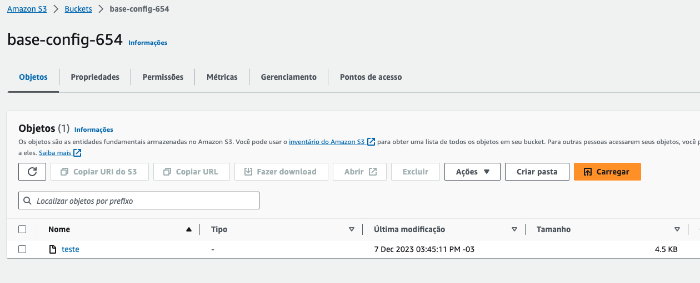
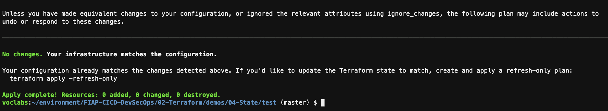

1. Execute o comando `cd ~/environment/FIAP-CICD-DevSecOps/02-Terraform/demos/04-State/` para entrar na pasta do exercicío.'
2. Vamos utilizar o bucket criado na configuração inicial para guardar o estado remoto.
3. Entre na pasta 'test' com o comando `cd test`
4.  Utilize o comando `c9 open state.tf` para abrir o arquivo responsavel por configurar o estado remoto e adicione o nome do bucket criado na configuração.
5.  Utilize o comando `terraform init` para sincronizar com o estado remoto
6.  Execute o comando `terraform apply -auto-approve`
7.  Se for agora no [bucket do S3](https://s3.console.aws.amazon.com/s3/buckets?region=us-east-1) que criou para o exercicio você poderá ver que foi criado um arquivo com o nome teste. Nele constam todas as indormações de tudo que o terraform executou dentro da pasta test. Verifique baixando o arquivo e lendo.
    
8.  Execute o comando `rm -rf .terraform` para remover todos os arquivos de estado local do terraform
9.  Execute novamente `terraform init`, dessa vez além de baixar os plugins e providers também baixou o ultimo estado da sua infraestrutura.
10. Execute o comando `terraform apply -auto-approve`. Note que nada foi alterado ou adiiconado já que sua maquina ainda esta disponivel e o terraform descobriu isso via estado remoto.
    
11. Execute o comando `terraform destroy -auto-approve`
