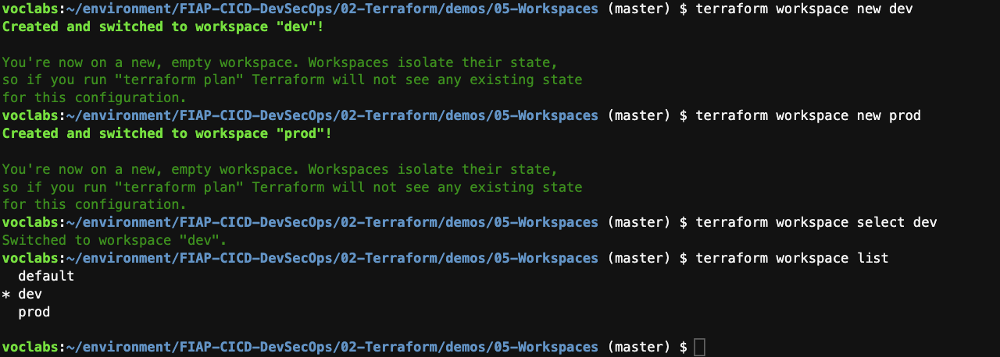

1. Execute o comando `cd ~/environment/FIAP-CICD-DevSecOps/02-Terraform/demos/05-Workspaces/` para entrar na pasta do exercicío.
2. tilize o comando `c9 open state.tf` para abrir o arquivo responsavel por configurar o estado remoto e adicione o do seu bucket S3 na linha 3. Caso não se lembre o nome do bucket execute o comando `aws s3 ls`.
3. Execute o comando `terraform init` para inicializar o terraform. Caso tenha dado erro porque o nome do bucket esta incorreto você terá que reconfigurar o estado remoto com o comando `terraform init -reconfigure`.

<details>
<summary> 
<b>Explicação Módulo Terraform</b>

</summary>

<blockquote>

Este módulo Terraform configura a criação de arquivos locais dinamicamente baseados no workspace do Terraform. Aqui está uma análise rápida do que o módulo entrega:

1. **Entrada**:  
   - Uma variável chamada `filename` que define o nome base do arquivo, sem a extensão. 

2. **Lógica Local**:  
   - Um bloco `locals` define o ambiente atual (`workspace`) e mapeia os nomes de arquivos baseados no workspace (`dev`, `homol`, `prod`).
   - Para cada ambiente, é adicionada uma extensão personalizada ao nome do arquivo (`-dev.txt`, `-homol.txt`, etc.).

3. **Recurso Criado**:  
   - Um recurso `local_file` é configurado, que:
     - Define o conteúdo do arquivo como o nome do ambiente atual.
     - Define o nome do arquivo com base no workspace e salva no diretório do módulo.

4. **Saídas**:  
   - `filename`: Retorna o nome completo do arquivo criado, incluindo o caminho e extensão.
   - `content`: Retorna o conteúdo do arquivo criado (nome do workspace).

**Uso principal**:  
Este módulo é útil para criar arquivos locais com nomes e conteúdos dinâmicos, baseados no ambiente em que o Terraform está sendo executado (ex.: desenvolvimento, homologação ou produção).

</blockquote>
</details>

4. Crie um novo workspace com o comando `terraform workspace new dev`
5. Crie outro workspace com o comando `terraform workspace new prod`
6. Para voltar ao ambiente dev execute `terraform workspace select dev`

<details>
<summary> 
<b>Explicação De Workspace</b>

</summary>

<blockquote>

### O que são Workspaces em Terraform?

Workspaces no Terraform são uma funcionalidade que permite criar e gerenciar configurações separadas dentro de um único diretório de configuração. Cada workspace tem seu próprio estado, o que possibilita gerenciar múltiplos ambientes (como **dev**, **staging** e **prod**) sem precisar duplicar configurações ou usar múltiplos diretórios.

Por padrão, todos os comandos do Terraform operam no workspace `default`, mas você pode criar e alternar entre outros workspaces para gerenciar estados diferentes.

---

### Benefícios dos Workspaces

1. **Gerenciamento Centralizado**: Permite manter a mesma configuração de infraestrutura para diferentes ambientes.
2. **Isolamento do Estado**: Cada workspace tem seu próprio arquivo de estado, garantindo que alterações em um ambiente não impactem outros.
3. **Automação Simples**: Simplifica a integração em pipelines de CI/CD, onde diferentes ambientes podem ser configurados dinamicamente.

---

### Como Utilizar Workspaces

1. **Criar um Novo Workspace**
   ```bash
   terraform workspace new <nome-do-workspace>
   ```
   Exemplo:
   ```bash
   terraform workspace new dev
   terraform workspace new prod
   ```

2. **Listar Workspaces**
   ```bash
   terraform workspace list
   ```

3. **Alternar Entre Workspaces**
   ```bash
   terraform workspace select <nome-do-workspace>
   ```
   Exemplo:
   ```bash
   terraform workspace select prod
   ```

4. **Deletar um Workspace**
   ```bash
   terraform workspace delete <nome-do-workspace>
   ```
   > **Nota**: Você não pode deletar o workspace atual. Troque para outro workspace antes de deletar.

5. **Uso em Configurações**
   Você pode usar o nome do workspace na lógica da configuração, como no exemplo abaixo:
   ```hcl
   locals {
     env = terraform.workspace
   }

   resource "aws_s3_bucket" "example" {
     bucket = "my-app-${local.env}"
     acl    = "private"
   }
   ```
   Aqui, o nome do bucket será dinâmico, dependendo do workspace (`my-app-dev`, `my-app-prod`, etc.).

6. **Estado por Workspace**
   Cada workspace mantém um arquivo de estado separado, geralmente em `.terraform/environment/<workspace>.tfstate`, garantindo que alterações em um workspace não impactem os outros.

---

### Boas Práticas com Workspaces

1. **Ambientes Simples**: Use workspaces para ambientes isolados, mas para projetos mais complexos ou equipes grandes, considere usar múltiplos diretórios ou repositórios.
2. **Consistência no Nome**: Utilize convenções de nomenclatura claras e consistentes (ex.: `dev`, `staging`, `prod`).
3. **Variáveis Diferenciadas**: Combine workspaces com variáveis específicas para cada ambiente, ajudando a personalizar recursos sem modificar o código principal.

---

### Limitações

1. **Separação Limitada**: Workspaces compartilham o mesmo conjunto de configurações, o que pode ser uma limitação em projetos que exigem configurações totalmente distintas.
2. **Integração com Backend**: Certifique-se de que o backend utilizado (como S3 ou Consul) suporta múltiplos estados associados a workspaces.

---

Workspaces são uma solução prática para projetos pequenos ou de médio porte que precisam gerenciar múltiplos ambientes. No entanto, para projetos mais complexos, pode ser preferível utilizar estratégias mais robustas, como repositórios separados por ambiente ou configurações modulares.

</blockquote>
</details>

7. Para listar todos os workspaces execute `terraform workspace list`, note que um workspace default esta listado ele é criado pelo terraform automaticamente.

   

8. Rode o apply (`terraform apply -auto-approve`) com cada um dos ambiente e note que serão gerados arquivos diferentes para cada workspaces dentro da pasta 'modules'. Para trocar de ambiente utilize o comando `terraform workspace select NOMEDAWORKSPACE`.
9.  Se for no Bucket verá que foi criada uma estrutura de pastas para os workspaces que criou. E dentro das pastas prod e dev tem um arquivo 'workspaces' que é o estado do workspace em questão.
10. De volta ao terminal execute um comando `ls modules/file/*.txt`, vai ver para para cada apply que fez foi criado um arquivo para o workspace.
11. No workspace 'prod' execute o comando `terraform destroy -auto-approve`.
12. Verifique o arquivo txt do prod não esta mais na pasta mas o dev esta intacto.
13. Olhe no arquivo referente ao ambiente prod no bucket do S3, ao ler o mesmo irá notar que esta vazio, tamanho pequeno, mas não foi excluido. 

### Exercicio
Caso deseje fazer um exercicio prático para ajudar a fixar o conteudo faça o proposto na seguinte página: [Exercício](../../exercicios/State-e-workspace/README.md)