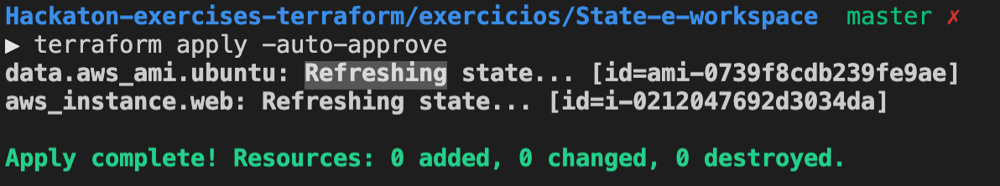

1. Execute o comando `cd ~/environment/FIAP-CICD-DevSecOps/02-Terraform/exercicios/State-e-workspace/` para entrar na pasta do exercício.
2. Crie arquivos de configuração terraform para que crie:
   1. Um datasource de imagem AMI ([aws_ami](https://registry.terraform.io/providers/hashicorp/aws/latest/docs/data-sources/ami)) que pesquise a imagem amazon linux 2 com os seguintes parametros:
      1. Name = amzn2-ami-hvm-2.0.202*-x86_64-gp2
      2. Owners = amazon
      3. virtualization-type = hvm
      4. Mais recente
   2. 2 instancias ec2 t2.micro que irão utilizar a imagem do datasource do item 1
3. No nome da ec2 deve contar o contar o workspace que ela se encontra. Ex: ec2-dev, ec2-prod, ec2-homol
4. O estado do terraform deve ser configurado para ser guardado no s3 criado em aula para esse fim e com a chave "ex-state-workspace".
5. Devem ser criados e executados ao menos 2 workspaces
   
6. Para verificar que o estado remoto esta funcionando, execute o comando `rm -rf .terraform` que ira apagar as cópias locais do estado e execute novamente o `terraform init`. Verifique dentro de cada workspace se o comando apply não cria nada.
   
7. Destrua as instancias em todos os workspaces

### Dicas
Como interpolar o nome do workspace no nome do recurso: [documentação](https://www.terraform.io/docs/language/state/workspaces.html#current-workspace-interpolation)
