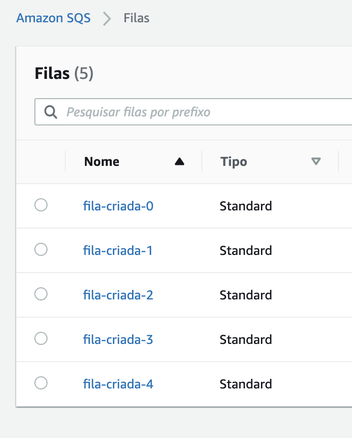

1. Execute o comando `cd ~/environment/FIAP-CICD-DevSecOps/02-Terraform/exercicios/count/` para entrar na pasta do exercício.
2. Crie um arquivo de terraform para criar filas sqs segundo a [documentação oficial](https://registry.terraform.io/providers/hashicorp/aws/latest/docs/resources/sqs_queue). Utilize apenas os atributos:
   1. Nome
   2. Tags
3. Adicione a região da aws a ser utilizada no provider, us-east-1, de acordo o exemplo de [count do terraform no github](https://github.com/terraform-providers/terraform-provider-aws/blob/master/examples/count/main.tf)
4. Crie um parametro afim de conseguir criar o numero desejado de filas. Utilize variavel e count([documentação count](https://www.terraform.io/docs/configuration-0-11/interpolation.html#count-information)) para isso.
5. Para verificar vá ao console do serviço SQS e ele deve estar parecido com a imagem a baixo:

6. Ao final remova todos as filas criadas
