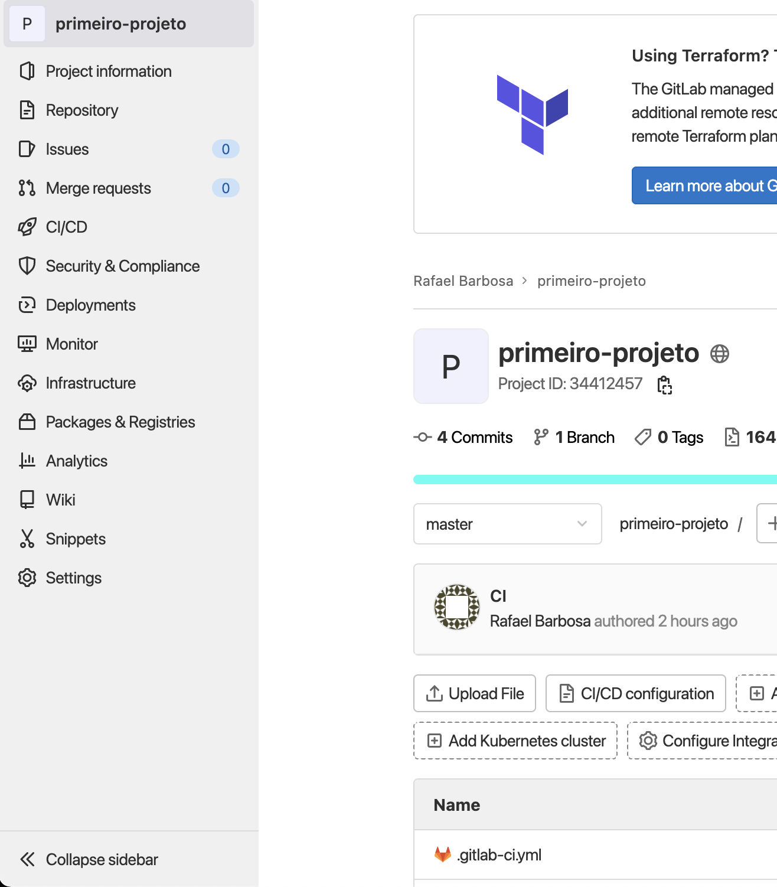
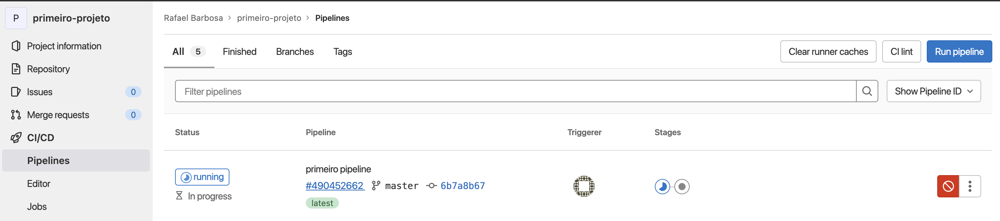
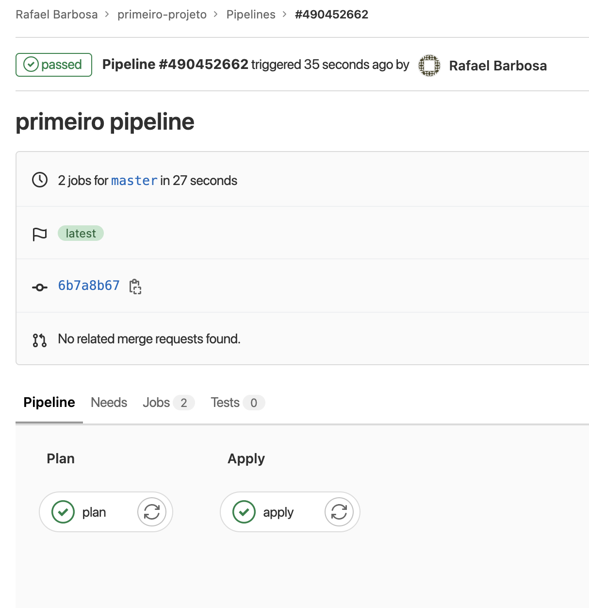

1. Nesse exercicio você irá utilizar o primeiro pipeline de CI/CD utilizando gitlab. Para iniciar entre na pasta onde esta o código do repositório cirado no exercício anterior. `cd ~/environment/primeiro-projeto/`.
2. Crie o arquivo .gitlab-ci.yml que terá as intruções do que fazer no pipeline. `c9 open .gitlab-ci.yml`
3. Inclua o conteúdo abaixo no .gitlab-ci.yml. Com esses comandos o pipeline terá 2 etapas. Plan e Apply. Plan será a parte de CI e apply a de CD. Note que o arquivo plan é exportado para ser utilizado na etapa de apply.
```yaml
---
stages:
  - plan
  - apply
plan:
  stage: plan
  script:
    - terraform init
    - terraform plan -out "planfile"
  artifacts:
    paths:
      - planfile
  tags:
    - shell

apply:
  stage: apply
  script:
    - terraform init
    - terraform apply planfile
  dependencies:
    - plan
  tags:
    - shell
```
4. Modifique o nome do bucket no state.tf para o que esta utilizando para guardar o estado nas demos anteriores. Para abrir o arquivo utilize o comando `c9 open state.tf`
5. Atualize o repositório do gitlab com os seguintes comandos:
```shell
git add .gitlab-ci.yml
git commit -m "primeiro pipeline"
eval $(ssh-agent -s)    
ssh-add -k /home/ubuntu/.ssh/gitlab
git push origin master
```
6. Vá até o gitlab, abra seu projeto `primeiro-projeto` e na lateral esquerda clique em `CI/CD` e após clique em `pipelines`

7. Você verá o pipeline rodando como na imagem abaixo:
   
8. Clique no id da execução do pipeline para conseguir acessar todas as etapas e ler os logs das etapas
   
9. Sinta-se a vontade para explorar as etapas.
10. Se tudo der certo, quando entrar no painel do SQS terá uma fila chamada `terraform-example-queue`. [Painel SQS](https://console.aws.amazon.com/sqs/v2/home?region=us-east-1#/queues)
