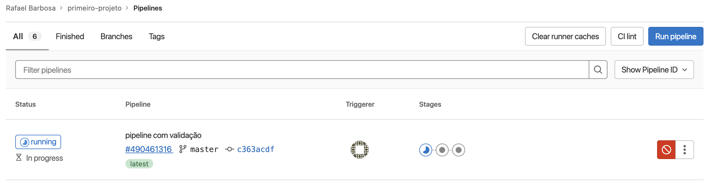
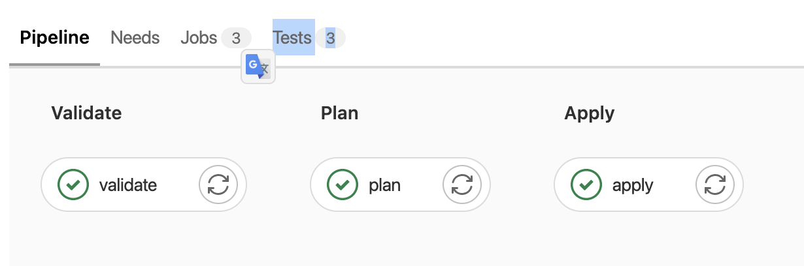
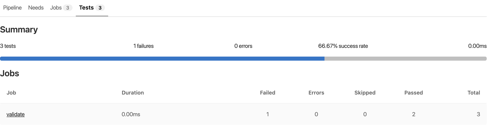
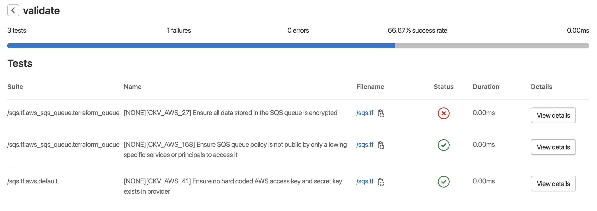

1. Continuando no repositório primeiro-projeto, nesta demo você irá adicionar um passo para validar o código e gerar um relatório sobre os testes. Entre na pasta do projeto `cd ~/environment/primeiro-projeto/`
2. Abra o arquivo .gitlab-ci.yml para alterar o conteúdo do script do pipeline. Para abrir utilize o comando `c9 open .gitlab-ci.yml`. 
3. Atualize o código para que ele fique como o exemplo abaixo. Foi adicionado o stage validate que aplica tando o terraform validate para verificar a sintaxe do terraform quanto o [checkov](https://www.checkov.io/) que irá fazer verificações de padrões de segurança e operação comuns no mercado. Ao final ele gera e exporta um relatório no formaro junit xml.
```yaml
stages:
  - validate
  - plan
  - apply

validate:
  stage: validate
  script:
    - terraform init
    - terraform validate
    - source /home/ubuntu/venv/bin/activate
    - checkov --directory . --framework terraform -o junitxml > Checkov-Report.xml && checkInfra="passou" || checkInfra="não passou"
    - echo $checkInfra
    - ls -lha
  tags:
    - shell
  artifacts:
    paths:
      - Checkov-Report.xml
    reports:
      junit: Checkov-Report.xml
plan:
  stage: plan
  script:
    - terraform init
    - terraform plan -out "planfile"
  dependencies:
    - validate
  artifacts:
    paths:
      - planfile
  tags:
    - shell

apply:
  stage: apply
  script:
    - terraform init
    - terraform apply planfile
  dependencies:
    - plan
  tags:
    - shell
```

4. Atualize o repositório do gitlab com os seguintes comandos:

```shell
git add .gitlab-ci.yml
git commit -m "pipeline com validação"
eval $(ssh-agent -s)    
ssh-add -k /home/ubuntu/.ssh/gitlab
git push origin master
```
5. Vá até os pipelines do seu repositório e note que agora são 3 passos ao invés de 2.
   
6. Aguarde o pipeline terminar e clique em `Tests`
   
7. Nessa tela o gitlab mostra um resumo dos testes executados por essa execução do pipeline. Clique em `validate` para detalhar
   
8. Esses foram os testes aplicados no repositório baseados nos recursos descritos na configuração do terraform.
